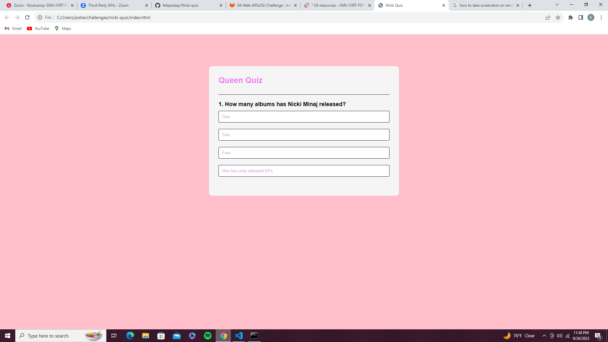

# Nicki-Quiz

## Overview
Working on this module has been fun because we got to make it our own. With some criteria missing, I am still happy with how much I completed. We were asked as coding boot camp student to build a quiz with a timer and record scores in local storage with initials. In javascript I was able to implement what we've learned about Web APIs and Javascript so far. For example, using getElementById by targetting buttons for answers and continuing to next question. 

## Assets 

## Contribute
kevinserrano0823@gmail.com